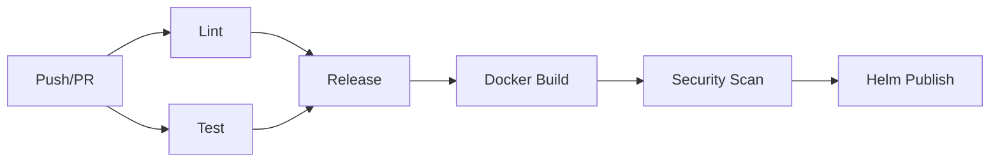

# CI/CD Workflows

This repository uses reusable workflows from [jacaudi/github-actions](https://github.com/jacaudi/github-actions) for automated testing, building, and releasing.

## Workflows

### Main CI/CD Pipeline (`ci-cd.yml`)

Runs on every push to `main` and on pull requests:

1. **Lint** - Validates YAML, Helm charts, and Go code
2. **Test** - Runs Go tests with 80% coverage requirement
3. **Release** - Creates semantic version and GitHub release (main only)
4. **Docker Build** - Builds multi-arch container images (amd64, arm64)
5. **Security Scan** - Scans images for vulnerabilities
6. **Helm Publish** - Publishes chart to OCI registry at `ghcr.io`

### PR Validation (`pr.yml`)

Fast feedback on pull requests:
- Linting (YAML, Helm, Go)
- Testing with coverage
- Docker build verification (no push)
- Security scanning with Trivy (CRITICAL, HIGH vulnerabilities)

## Setup Requirements

### GitHub Secrets

The workflows require these secrets:

| Secret | Required For | Description |
|--------|-------------|-------------|
| `APP_ID` | Releases | GitHub App ID for triggering workflows |
| `APP_PRIVATE_KEY` | Releases | GitHub App private key |
| `GITHUB_TOKEN` | All | Auto-provided by GitHub |

### GitHub App Setup

To enable semantic releases that trigger downstream workflows:

1. Create a GitHub App:
   - Go to Settings → Developer settings → GitHub Apps → New GitHub App
   - Name: `[org]-release-bot`
   - Homepage URL: Your organization URL
   - Webhook: Disable
   - Permissions:
     - Contents: Read & Write
     - Issues: Read & Write
     - Pull Requests: Read & Write
   - Install the app on your repositories

2. Generate a private key:
   - In your GitHub App settings → Private keys → Generate
   - Download the `.pem` file

3. Add secrets to your repository:
   - `APP_ID`: The App ID from your GitHub App
   - `APP_PRIVATE_KEY`: Contents of the `.pem` file

### Container Registry

Images are published to GitHub Container Registry (ghcr.io):
- Automatic authentication using `GITHUB_TOKEN`
- Public or private based on repository visibility
- Multi-arch support (linux/amd64, linux/arm64)

## Versioning

This project uses [Semantic Versioning](https://semver.org/) based on [Conventional Commits](https://www.conventionalcommits.org/).

### Commit Message Format

```
<type>[optional scope]: <description>

[optional body]

[optional footer(s)]
```

### Commit Types

| Type | Version Bump | Example |
|------|--------------|---------|
| `fix:` | Patch (0.0.x) | `fix: resolve nil pointer in controller` |
| `feat:` | Minor (0.x.0) | `feat: add allowlist controller` |
| `feat!:` or `BREAKING CHANGE:` | Minor (0.x.0) during 0.x, Major (x.0.0) after 1.0 | `feat!: change API structure` |

### Examples

**Feature:**
```
feat: add support for cross-namespace list references

Allows profiles to reference allow/deny/TLD lists from other namespaces.
This enables centralized list management.
```

**Bug Fix:**
```
fix: prevent nil pointer when profile missing credentials

Added nil check before accessing credentials secret to prevent
reconciliation panic.
```

**Breaking Change:**
```
feat!: migrate to jacaudi/nextdns-go v0.2.0

BREAKING CHANGE: Module path changed from github.com/amalucelli/nextdns-go
to github.com/jacaudi/nextdns-go. Users must update import paths.
```

## Manual Testing

Run workflows locally using [act](https://github.com/nektos/act):

```bash
# Test linting
act pull_request -j lint

# Test with coverage
act pull_request -j test

# Build containers locally
docker build -t nextdns-operator:local .
```

## Troubleshooting

### Coverage Threshold Failures

If tests fail due to coverage below 80%:
1. Check which files lack coverage: `go tool cover -html=coverage.out`
2. Add tests for uncovered code
3. Or adjust threshold in `ci-cd.yml` if justified

### Docker Build Failures

Common issues:
- Multi-arch builds require `docker buildx`
- Check Dockerfile syntax and build context
- Verify all dependencies are available

### Helm Chart Validation

Lint charts locally:
```bash
helm lint chart/
helm template test chart/ --debug
```

### Release Not Triggering

Checklist:
- Commit message follows Conventional Commits format
- Push is to `main` branch
- GitHub App secrets are configured
- Previous workflows completed successfully

## Workflow Dependencies



## Local Development

Before pushing:
```bash
# Run tests
go test ./... -v -cover

# Lint code
golangci-lint run

# Build locally
docker build -t nextdns-operator:dev .

# Test Helm chart
helm lint chart/
helm template test chart/
```
